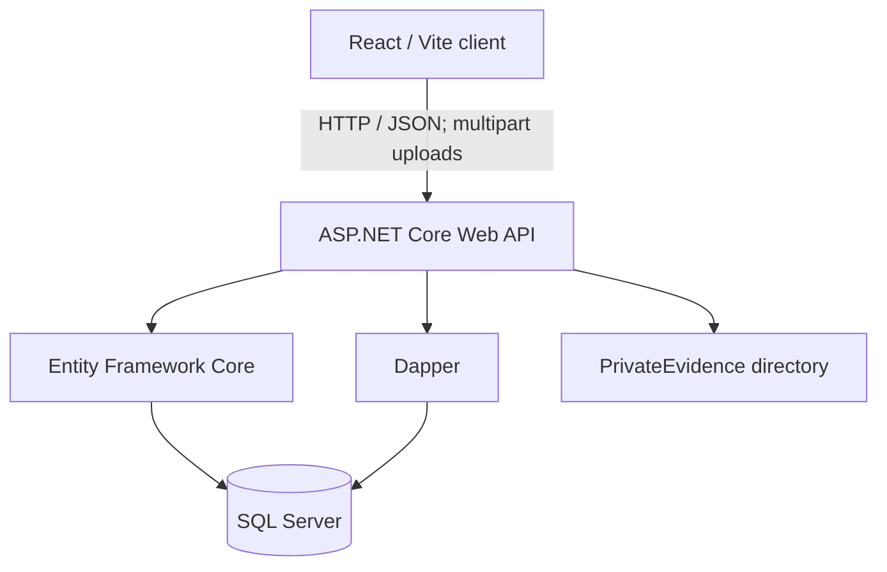

# TracePoint Investigations

**A full-stack digital investigation and evidence-management application**

   

TracePoint Investigations is a web-based case-management prototype developed for **NWED622 — Web Development II**, based on the fictional *Operation Digital Detective* brief. The application helps an investigator review a case, examine suspects and evidence, select a suspect, submit an investigation conclusion, and retrieve submitted findings.

The project also extends the coursework with a **written-evidence attachment API** that supports uploading, storing, listing, and downloading documents.

> **Project status:** Academic prototype. The original investigation flow and the written-document API have been exercised during development. Browser-side document upload and any additional UI enhancements should be verified on the current checkout before being described as fully tested. The application is not suitable for real confidential investigations without additional security controls.

## The case: The Missing Prototype

An experimental technology prototype disappeared from a secure research laboratory between **22:00 and 00:00**. The investigator is given three employees with legitimate access to the facility:

| Suspect | Role | Background provided in the scenario |
| --- | --- | --- |
| Alex Morgan | Software Developer | Developed the prototype software and had laboratory access |
| Jamie Smith | Security Officer | Was responsible for building security on the night of the incident |
| Taylor Williams | Research Assistant | Worked with the research team and had laboratory access during working hours |

Five seeded evidence items form the starting case file: **Security Access Log**, **CCTV Report**, **Fingerprint Report**, **Email Message**, and **Photograph**. The application supports reviewing the evidence and recording a conclusion; it does not treat suspicion as proof of guilt.

## Features

### Core investigation workflow

- View the case description and status.
- Browse suspects retrieved from the API and select a suspect using React state.
- Browse and examine the five seeded evidence items.
- Enter and submit an investigation conclusion linked to a case and suspect.
- Persist investigations to SQL Server through Entity Framework Core.
- Retrieve submitted investigations together with suspect names through a Dapper-backed API operation.
- Navigate between Home, Case, Suspects, Evidence, and Investigation pages.

### Written-evidence attachments

- Register an uploaded document against an existing case.
- Accept **PDF, DOCX, and TXT** files up to **10 MB** in the current API implementation.
- Store the binary file in the backend's private `PrivateEvidence/` folder (outside `wwwroot`).
- Store metadata in the `EvidenceAttachments` SQL Server table, including the case ID, original filename, upload time, file size, and SHA-256 checksum.
- List and download stored attachments using dedicated API endpoints.
- **Backend verified:** a fictional TXT statement was uploaded (HTTP 201), retrieved, downloaded, and confirmed byte-for-byte equivalent by matching SHA-256 hashes.
- **React integration:** an upload/list/download interface has been prepared for the Evidence page; confirm the browser workflow on the checked-in version before marking it tested.

### Planned / optional improvements

- Record, upload, and play back authorised suspect interviews.
- Manage evidence-to-suspect associations and interview notes.
- Add authenticated investigator accounts, per-case permissions, and audit logs.
- Improve evidence validation, background-check verification and document previews.

## Technology stack

| Layer | Technology |
| --- | --- |
| Frontend | React, JavaScript/JSX, Vite, CSS, React Router |
| Backend | ASP.NET Core Web API (.NET 10), C# |
| ORM | Entity Framework Core |
| Additional data access | Dapper |
| Database | Microsoft SQL Server |
| API design | Attribute-routed REST endpoints, JSON |
| Quality assurance | Backend integration tests and React unit tests |
| File integrity | SHA-256 hashes for uploaded attachments |

## Architecture



React never connects directly to SQL Server. The API controls database operations and file access.

## Repository layout

```text
TracePoint-Investigations/
├── TracePointAPI/             # ASP.NET Core controllers, models, EF migrations
├── TracePointAPI.Tests/       # Backend integration tests
├── TracePointClient/          # React application, components, styling, tests
├── README.md
└── .gitignore
```

The project folders may initially be located separately on a development machine. Group them under a single repository directory before publishing.

## Getting started

### Prerequisites

- .NET 10 SDK
- Node.js and npm compatible with the frontend's Vite version
- Microsoft SQL Server or SQL Server Express/LocalDB, configured for the API
- EF Core CLI (`dotnet-ef`), if applying migrations
- Git (for cloning and contributing)

### 1. Clone and configure

```powershell
git clone https://github.com/<YOUR-USERNAME>/TracePoint-Investigations.git
cd TracePoint-Investigations
```

The API uses a SQL Server connection string configured in `TracePointAPI/Program.cs`. **Check the actual connection-string key in `Program.cs`** and supply a development connection string securely, for example through .NET User Secrets or an environment variable. Do not commit passwords or working database connection strings.

Example PowerShell configuration (replace the placeholder key with the one used by `Program.cs`):

```powershell
cd .\TracePointAPI
# If needed, initialise user secrets once for the project:
dotnet user-secrets init
# Substitute your own SQL Server instance, database, and actual key:
dotnet user-secrets set "ConnectionStrings:<KEY-FROM-PROGRAM-CS>" "Server=<SERVER>;Database=<DATABASE>;Trusted_Connection=True;TrustServerCertificate=True;"
```

> The example uses Windows authentication. Update the connection string for your SQL Server environment. Keep `appsettings*.json` files containing secrets out of Git.

### 2. Set up and run the API

From `TracePointAPI/`:

```powershell
dotnet restore
dotnet build
dotnet ef database update
dotnet run
```

The API has been run locally at `http://localhost:5291` using the project's development launch settings. If your port differs, update the React API URL or development configuration accordingly. The EF Core migrations create the schema and the context seeds the fictional case, suspects and five initial evidence records.

### 3. Run the React client

In another terminal, from `TracePointClient/`:

```powershell
npm install
npm run dev
```

Open the Vite URL printed in the terminal (commonly `http://localhost:5173`). If the client and API run on different origins, confirm the API's CORS configuration allows your Vite port.

### 4. Run tests

From `TracePointAPI/`:

```powershell
dotnet test
```

From `TracePointClient/`:

```powershell
npm test -- --run
npm run build
```

These commands run the existing automated test suites and production build. File upload/download behaviour should additionally be tested end-to-end in the browser and API.

## API reference

| Method | Route | Purpose |
| --- | --- | --- |
| `GET` | `/api/Cases` | List cases |
| `GET` | `/api/Cases/{id}` | View one case |
| `GET` | `/api/Suspects` | List suspects |
| `GET` | `/api/Suspects/{id}` | View one suspect |
| `GET` | `/api/Evidence` | List seeded evidence |
| `GET` | `/api/Evidence/{id}` | View evidence details |
| `POST` | `/api/Investigations` | Submit an investigation |
| `GET` | `/api/Investigations` | List investigations |
| `GET` | `/api/Investigations/{id}` | View an investigation |
| `GET` | `/api/Investigations/submitted` | Retrieve submitted investigations via Dapper |
| `GET` | `/api/EvidenceAttachments` | List uploaded document metadata |
| `POST` | `/api/EvidenceAttachments/upload` | Upload written evidence (`multipart/form-data`) |
| `GET` | `/api/EvidenceAttachments/{id}/download` | Download an attachment |

### Example: upload a fictional document

With the API running, use PowerShell from a directory containing a sample `.txt` file:

```powershell
curl.exe -X POST "http://localhost:5291/api/EvidenceAttachments/upload" `
  -F "caseID=1" `
  -F "title=Test Witness Statement" `
  -F "description=Fictional evidence for testing" `
  -F "file=@sample-statement.txt"
```

A successful request returns **HTTP 201 Created** and the new attachment ID. Retrieve the metadata through `GET /api/EvidenceAttachments`, then download the attachment using its ID.

## Database design

The core schema includes:

- **Cases:** case name, description and status.
- **Suspects:** name, occupation, description and optional supplementary fields.
- **Evidence:** original scenario evidence, including title, location and description.
- **Investigations:** records linking a case and suspect to an investigator's conclusion.
- **EvidenceAttachments:** case-linked uploaded files and retrieval metadata.

Entity Framework Core migrations version the database schema. The original seeded evidence and newly uploaded attachments are stored separately so that the coursework's initial evidence remains intact.

## Security and ethical use

This repository is for a **fictional educational scenario**. The current document-upload controller is a local prototype, not a production-ready evidence vault. In particular:

- Upload, listing and download endpoints must be protected by authentication and authorization before use with confidential material.
- File-extension and size checks do **not** fully validate document contents; malware scanning and stronger file-type validation are needed for real deployments.
- Private file storage should be access-controlled, backed up together with database metadata, and protected from accidental Git commits.
- An evidence checksum can help detect accidental or malicious file changes, but it does not on its own establish an evidentiary chain of custody.
- Interview recordings require appropriate consent or other lawful authority, access controls, and retention practices.
- Suspect background data should not be invented or interpreted as proof of guilt.

Do not commit real interview recordings, witness documents, credentials, local database files or sensitive personal information.

## Academic context

Built for the **NWED622 Web Development II Practical Assignment — Operation Digital Detective** at Sol Plaatje University. The assignment emphasises full-stack integration using React, ASP.NET Core Web API, EF Core, Dapper, routing, React props/state, and automated tests.

## Acknowledgements

Based on the fictional TracePoint Investigations assignment scenario and extended as a practical exploration of digital evidence management.

---

**Note:** Repository ownership, contributors, screenshots and licence information can be added once the GitHub repository is created and the team agrees on publication terms.
